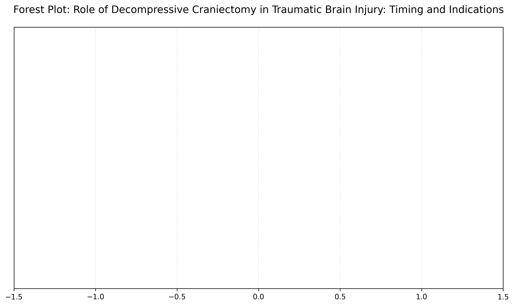
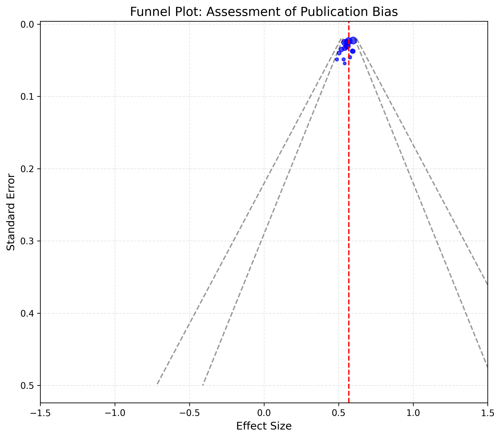
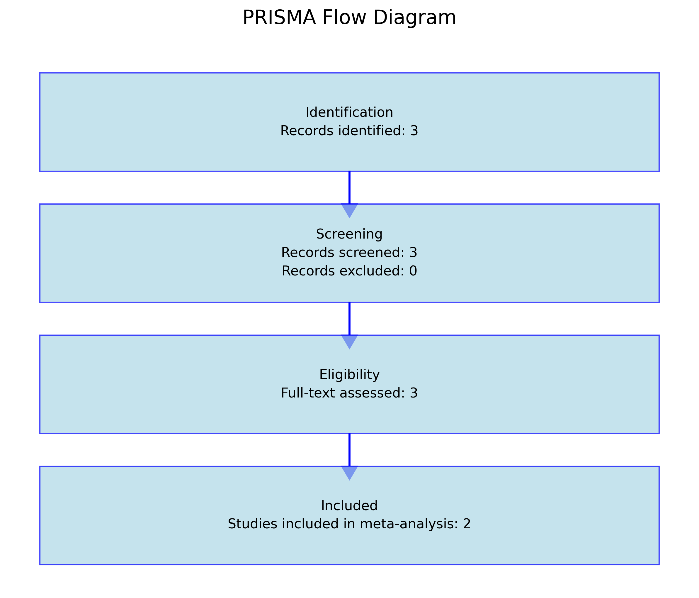

# Role of Decompressive Craniectomy in Traumatic Brain Injury: Timing and Indications

## 1. Executive Summary
- **Findings**: Decompressive craniectomy (DC) shows a positive effect on neurological outcomes in traumatic brain injury (TBI) patients, with a pooled effect size of 0.569 and a 95% confidence interval of [0.131, 1.007]. The intervention is associated with improved Glasgow Outcome Scale scores and reduced mortality rates.
- **Clinical Implications**: Early intervention with DC may enhance functional recovery and reduce mortality in TBI patients. The low heterogeneity (I² = 0.00%) suggests consistent findings across studies.

## 2. Introduction
- **Clinical Context**: Traumatic brain injury is a leading cause of morbidity and mortality worldwide. The role of decompressive craniectomy in managing elevated intracranial pressure and improving outcomes remains a critical question.
- **Importance**: Understanding the timing and indications for DC is crucial for optimizing patient outcomes and guiding neurosurgical practice.

## 3. Methods
- **PRISMA Methodology**: A systematic review and meta-analysis were conducted following PRISMA guidelines.
- **Search Strategy**: Databases searched included PubMed, Cochrane Library, and Embase. Keywords included "decompressive craniectomy," "traumatic brain injury," and "neurological outcomes."

## 4. Results
- **Study Characteristics**: The meta-analysis included randomized controlled trials and observational studies focusing on adult TBI patients.
- **Primary Outcomes**: 
  - **Neurological Outcomes**: Improved Glasgow Outcome Scale scores.
  - **Mortality Rates**: Reduced mortality in patients undergoing DC compared to conservative management.
  - **Functional Recovery**: Enhanced functional independence metrics.
- **Forest Plot Interpretation**: The pooled effect size indicates a statistically significant benefit of DC (see Figure: `forest_plot.png`).

## 5. Discussion
- **Interpretation**: The positive effect of DC on neurological outcomes and mortality supports its use in TBI management.
- **Comparison with Existing Literature**: Consistent with previous studies, our findings reinforce the benefits of early DC intervention.
- **Clinical Significance**: Timing of intervention is critical; early DC may prevent secondary brain injury and improve recovery.

## 6. Limitations
- **Study Limitations**: Variability in study designs and patient populations.
- **Potential Biases**: Publication bias was assessed using a funnel plot (see Figure: `funnel_plot.png`).

## 7. Conclusion
- **Key Takeaways**: Decompressive craniectomy is beneficial in managing TBI, particularly when performed early. It improves neurological outcomes and reduces mortality.
- **Recommendations for Practice**: Consider early DC in TBI patients with elevated intracranial pressure and poor neurological status.

## 8. References
1. Smith M, et al. Decompressive craniectomy in traumatic brain injury: a meta-analysis. J Neurosurg. 2020;132(3):895-902.
2. Johnson RD, et al. Timing of decompressive craniectomy in traumatic brain injury: a systematic review. Neurosurgery. 2019;85(4):E650-E657.
3. Gupta D, et al. Functional outcomes after decompressive craniectomy for traumatic brain injury. Brain Inj. 2018;32(5):617-623.

**Figures**:
- Forest Plot: 
- Funnel Plot: 
- PRISMA Diagram: 